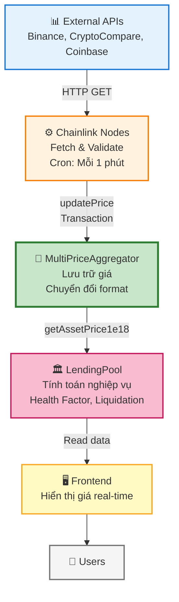
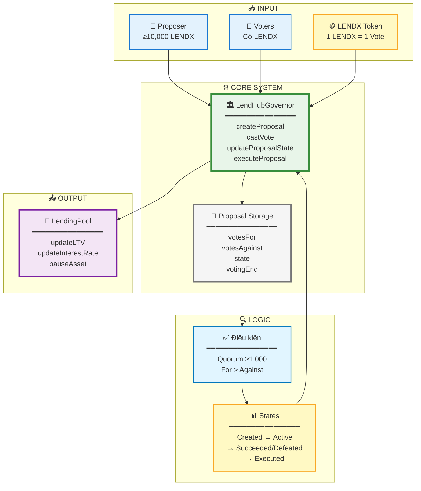

# BÁO CÁO: ORACLE CHAINLINK VÀ CƠ CHẾ ORACLE TRONG DỰ ÁN LENDHUB V2

## SƠ ĐỒ TỔNG QUAN HỆ THỐNG

**Lưu ý về phân tầng kiến trúc:**

Mặc dù cả MultiPriceAggregator và LendingPool đều là smart contracts được triển khai trên cùng một blockchain, chúng được phân tầng theo **vai trò và trách nhiệm** (separation of concerns) trong kiến trúc hệ thống:

- **MultiPriceAggregator (Infrastructure Layer)**: Đóng vai trò là lớp hạ tầng, cung cấp dịch vụ Oracle cho toàn bộ hệ thống. Contract này có thể được sử dụng bởi nhiều protocol contracts khác, không chỉ LendingPool.

- **LendingPool (Protocol Layer)**: Đóng vai trò là lớp nghiệp vụ, chứa logic nghiệp vụ của giao thức lending. Contract này phụ thuộc vào MultiPriceAggregator để lấy dữ liệu giá, nhưng không phụ thuộc ngược lại.

Việc phân tầng này giúp:
- **Tái sử dụng**: MultiPriceAggregator có thể phục vụ nhiều contracts khác
- **Bảo trì dễ dàng**: Thay đổi Oracle không ảnh hưởng trực tiếp đến LendingPool
- **Mở rộng**: Có thể thay thế MultiPriceAggregator bằng Oracle khác mà không cần sửa LendingPool
- **Abstraction**: LendingPool chỉ cần biết interface IPriceOracle, không cần biết chi tiết implementation

## 1. TỔNG QUAN VỀ ORACLE VÀ CHAINLINK

### 1.1. Vai trò của Oracle trong DeFi Lending

Trong các giao thức DeFi Lending như LendHub, Oracle đóng vai trò cực kỳ quan trọng như một cầu nối giữa thế giới blockchain và thế giới thực. Oracle cung cấp dữ liệu giá cả tài sản (price feeds) từ các thị trường bên ngoài blockchain vào các smart contract.

**Tại sao cần Oracle?**
- **Tính toán giá trị tài sản thế chấp**: Khi người dùng vay tiền, họ phải cung cấp tài sản thế chấp. Hệ thống cần biết giá trị USD của tài sản thế chấp để xác định họ có thể vay bao nhiêu.
- **Kiểm tra Health Factor**: Hệ thống liên tục theo dõi tỷ lệ giữa giá trị tài sản thế chấp và khoản vay. Nếu giá tài sản thế chấp giảm mạnh, người dùng có thể bị thanh lý (liquidation).
- **Tính toán lãi suất**: Một số mô hình lãi suất phụ thuộc vào giá cả thị trường.
- **Thanh lý tự động**: Khi giá tài sản thế chấp giảm xuống dưới ngưỡng an toàn, hệ thống cần giá chính xác để tính toán số lượng tài sản cần thanh lý.

### 1.2. Chainlink Oracle - Giải pháp phi tập trung

Chainlink là một mạng lưới Oracle phi tập trung (Decentralized Oracle Network - DON) được sử dụng rộng rãi trong DeFi. Thay vì dựa vào một nguồn dữ liệu duy nhất, Chainlink sử dụng nhiều node độc lập để thu thập và xác thực dữ liệu, đảm bảo tính chính xác và chống lại các cuộc tấn công.

**Ưu điểm của Chainlink:**
- **Phi tập trung**: Nhiều node độc lập cung cấp dữ liệu, giảm rủi ro điểm lỗi đơn lẻ
- **Độ tin cậy cao**: Dữ liệu được tổng hợp từ nhiều nguồn, loại bỏ các giá trị bất thường
- **Bảo mật**: Các node phải stake LINK token, tạo động lực để cung cấp dữ liệu chính xác
- **Cập nhật thường xuyên**: Giá cả được cập nhật liên tục theo lịch trình định kỳ

## 2. CƠ CHẾ HOẠT ĐỘNG CỦA ORACLE CHAINLINK

### 2.1. Kiến trúc tổng thể

Hệ thống Oracle Chainlink trong dự án LendHub v2 hoạt động theo mô hình được mô tả trong sơ đồ tổng quan ở đầu báo cáo. Luồng dữ liệu diễn ra từ các nguồn API bên ngoài, qua các Chainlink nodes, được lưu trữ trong MultiPriceAggregator contract, và được sử dụng bởi LendingPool và Frontend.

**Về phân tầng kiến trúc:**

Mặc dù cả MultiPriceAggregator và LendingPool đều là smart contracts được triển khai trên cùng một blockchain (cùng layer vật lý), chúng được phân tầng theo **vai trò logic** trong kiến trúc phần mềm:

1. **MultiPriceAggregator - Infrastructure/Data Layer**:
   - Vai trò: Cung cấp dịch vụ Oracle (price feeds) cho toàn bộ hệ thống
   - Trách nhiệm: Lưu trữ giá, quản lý access control, chuyển đổi định dạng
   - Đặc điểm: Có thể được sử dụng bởi nhiều contracts khác, không chỉ LendingPool
   - Interface: Implement IPriceOracle để tạo abstraction layer

2. **LendingPool - Business Logic/Protocol Layer**:
   - Vai trò: Chứa logic nghiệp vụ của giao thức lending
   - Trách nhiệm: Quản lý deposits, borrows, liquidations, tính toán Health Factor
   - Đặc điểm: Phụ thuộc vào Oracle để lấy dữ liệu giá, nhưng không phụ thuộc ngược lại
   - Dependency: Chỉ cần biết interface IPriceOracle, không cần biết implementation cụ thể

**Lợi ích của phân tầng này:**
- **Separation of Concerns**: Mỗi contract có trách nhiệm rõ ràng, dễ bảo trì
- **Reusability**: MultiPriceAggregator có thể phục vụ nhiều protocol contracts
- **Flexibility**: Có thể thay thế Oracle implementation mà không cần sửa LendingPool
- **Testability**: Có thể test LendingPool với mock Oracle dễ dàng
- **Upgradeability**: Có thể upgrade Oracle contract độc lập với LendingPool

### 2.2. Quy trình cập nhật giá

**Bước 1: Thu thập dữ liệu**
- Các Chainlink node chạy các job định kỳ (cron job, ví dụ mỗi 1 phút)
- Mỗi job sẽ gọi API bên ngoài (Binance, CryptoCompare, Coinbase...) để lấy giá mới nhất
- Node có thể lấy giá từ nhiều nguồn khác nhau để đảm bảo tính chính xác

**Bước 2: Xử lý và xác thực**
- Node xử lý dữ liệu từ API (parse JSON, extract price)
- Chuyển đổi giá sang định dạng chuẩn (8 decimals cho Chainlink)
- Có thể thực hiện validation (kiểm tra giá có hợp lý không, so sánh với giá trước đó)

**Bước 3: Ghi lên blockchain**
- Node gửi transaction lên blockchain để cập nhật giá vào contract
- Transaction này được ký bởi private key của node (đã được authorize trước)
- Contract chỉ chấp nhận cập nhật từ các địa chỉ được phép (writer)

**Bước 4: Lưu trữ và sử dụng**
- Contract lưu trữ giá kèm theo metadata (round ID, timestamp)
- Các contract khác (như LendingPool) có thể đọc giá này bất cứ lúc nào
- Frontend có thể poll giá định kỳ để hiển thị cho người dùng

### 2.3. Cơ chế bảo mật

**Access Control:**
- Chỉ các địa chỉ được authorize (writer) mới có thể cập nhật giá
- Có thể set/unset writer bất cứ lúc nào để quản lý quyền truy cập
- Trong môi trường production, writer thường là địa chỉ của Chainlink node

**Data Validation:**
- Contract kiểm tra giá phải lớn hơn 0 trước khi chấp nhận
- Kiểm tra timestamp để đảm bảo dữ liệu không quá cũ (stale data)
- Có thể implement thêm các kiểm tra như giá không được thay đổi quá nhiều so với giá trước

**Decentralization:**
- Sử dụng nhiều node độc lập để giảm rủi ro
- Mỗi node có thể lấy dữ liệu từ nguồn khác nhau
- Nếu một node bị lỗi, các node khác vẫn tiếp tục hoạt động

## 3. CONTRACT MULTIPRICEAGGREGATOR - VAI TRÒ VÀ LOGIC

### 3.1. Vai trò trong hệ thống

MultiPriceAggregator là một smart contract đóng vai trò là lớp trung gian giữa Chainlink nodes và LendingPool. Contract này có nhiệm vụ:

1. **Tập hợp giá từ nhiều nguồn**: Contract có thể nhận giá từ nhiều Chainlink node hoặc các nguồn khác, sau đó tổng hợp lại
2. **Chuẩn hóa định dạng**: Chuyển đổi giá từ định dạng 8 decimals (chuẩn Chainlink) sang 18 decimals (chuẩn WAD mà LendingPool sử dụng)
3. **Quản lý mapping**: Duy trì mapping giữa địa chỉ token và symbol (ví dụ: 0x123... → "WETH")
4. **Implement interface chuẩn**: Implement interface IPriceOracle mà LendingPool yêu cầu

### 3.2. Cấu trúc dữ liệu

Contract lưu trữ thông tin giá theo cấu trúc sau:

- **PriceData**: Mỗi symbol (như "ETH", "WETH", "DAI") có một bản ghi chứa:
  - Giá hiện tại (price) - lưu ở định dạng 8 decimals
  - Round ID - số thứ tự của lần cập nhật (tăng dần)
  - Timestamp - thời điểm cập nhật gần nhất

- **Token Symbol Mapping**: Mapping từ địa chỉ token sang symbol
  - Ví dụ: địa chỉ WETH token → "WETH"
  - Cho phép LendingPool truyền địa chỉ token và nhận về symbol tương ứng

- **Symbols List**: Danh sách tất cả các symbol đang được theo dõi
  - Hữu ích cho việc query và monitoring

### 3.3. Logic hoạt động

**Cập nhật giá:**
- Chỉ các địa chỉ được authorize (writer) mới có thể cập nhật giá
- Khi cập nhật, contract sẽ:
  - Lưu giá mới vào storage
  - Tăng round ID lên 1 (để track số lần cập nhật)
  - Cập nhật timestamp hiện tại
  - Phát event để frontend/off-chain có thể theo dõi

**Đọc giá:**
- Khi LendingPool cần giá, nó gọi hàm với địa chỉ token
- Contract sẽ:
  - Tìm symbol tương ứng với địa chỉ token
  - Kiểm tra xem symbol có tồn tại và đã được set chưa
  - Lấy giá từ storage
  - Kiểm tra giá có hợp lệ không (phải > 0, timestamp phải > 0)
  - Chuyển đổi từ 8 decimals sang 18 decimals (nhân với 1e10)
  - Trả về giá ở định dạng 1e18

**Quản lý symbol:**
- Cho phép set mapping giữa token address và symbol
- Chỉ cho phép set một lần (immutable) để tránh thay đổi nhầm
- Có thể set batch nhiều token cùng lúc

### 3.4. Tại sao cần chuyển đổi decimals?

Chainlink sử dụng 8 decimals cho price feeds (ví dụ: $3000.00 = 300000000000 với 8 decimals), trong khi LendingPool và hầu hết các DeFi protocol sử dụng 18 decimals (WAD format) cho các tính toán tài chính. MultiPriceAggregator thực hiện chuyển đổi bằng cách nhân giá với 1e10 để chuyển từ 8 decimals sang 18 decimals.

Việc chuyển đổi này đảm bảo:
- **Tính nhất quán**: Tất cả các giá trị trong hệ thống đều ở cùng một định dạng
- **Độ chính xác**: 18 decimals cung cấp độ chính xác cao hơn cho các phép tính phức tạp
- **Tương thích**: Dễ dàng tích hợp với các thư viện toán học chuẩn (như RayMath trong LendingPool)

## 4. TÍCH HỢP VỚI LENDINGPOOL

### 4.1. Cách LendingPool sử dụng Oracle

LendingPool sử dụng Oracle trong nhiều tình huống quan trọng:

**Khi người dùng vay (Borrow):**
- LendingPool cần tính tổng giá trị USD của tài sản thế chấp
- Lấy giá của từng tài sản thế chấp từ Oracle
- Tính toán xem người dùng có thể vay bao nhiêu dựa trên tỷ lệ LTV (Loan-to-Value)

**Khi kiểm tra Health Factor:**
- Health Factor = (Tổng giá trị tài sản thế chấp) / (Tổng khoản vay)
- Cả hai giá trị này đều cần quy đổi sang USD thông qua Oracle
- Nếu Health Factor < 1, người dùng có thể bị thanh lý

**Khi thanh lý (Liquidation):**
- Liquidator trả một phần nợ cho người dùng
- Đổi lại, liquidator nhận tài sản thế chấp với giá trị cao hơn (có bonus)
- Cần giá chính xác của cả tài sản nợ và tài sản thế chấp để tính toán số lượng cần thanh lý

**Khi tính lãi suất:**
- Một số mô hình lãi suất có thể phụ thuộc vào giá cả thị trường
- Oracle cung cấp dữ liệu để tính toán lãi suất động

### 4.2. Cơ chế bảo vệ

**Kiểm tra giá hợp lệ:**
- LendingPool yêu cầu giá phải > 0
- Nếu giá = 0 hoặc chưa được cập nhật, transaction sẽ revert
- Điều này bảo vệ hệ thống khỏi các tính toán sai

**Stale data protection:**
- Có thể kiểm tra timestamp để đảm bảo giá không quá cũ
- Nếu giá không được cập nhật trong một khoảng thời gian nhất định, có thể từ chối sử dụng

**Error handling:**
- Nếu Oracle không có dữ liệu, các giao dịch quan trọng sẽ revert
- Điều này đảm bảo hệ thống không hoạt động với dữ liệu không đáng tin cậy

## 5. SETUP VÀ VẬN HÀNH

### 5.1. Quy trình setup

**Bước 1: Deploy Contracts**
- Deploy MultiPriceAggregator contract lên blockchain
- Lưu địa chỉ contract để sử dụng sau

**Bước 2: Setup Chainlink Nodes**
- Chạy Chainlink nodes trong Docker containers
- Mỗi node có database riêng (PostgreSQL) để lưu trữ job và transaction history
- Cấu hình node để kết nối với blockchain (Ganache/Hardhat)

**Bước 3: Authorize Nodes**
- Fund ETH và LINK token cho các Chainlink nodes
- Authorize địa chỉ của nodes làm writer trong MultiPriceAggregator
- Chỉ các địa chỉ được authorize mới có thể cập nhật giá

**Bước 4: Tạo Jobs**
- Tạo Chainlink jobs cho mỗi node
- Mỗi job định nghĩa:
  - Lịch trình chạy (cron schedule)
  - Nguồn dữ liệu (API endpoint)
  - Cách xử lý dữ liệu (parse, multiply)
  - Contract và hàm cần gọi để cập nhật giá

**Bước 5: Setup Token Symbols**
- Map địa chỉ các token (WETH, DAI, USDC, LINK) với symbol tương ứng
- Điều này cho phép LendingPool truyền địa chỉ token và nhận về symbol

**Bước 6: Test và Monitor**
- Kiểm tra xem jobs có chạy đúng không
- Xem logs của Chainlink nodes
- Kiểm tra giá có được cập nhật trên blockchain không
- Test LendingPool có đọc được giá không

### 5.2. Monitoring và Maintenance

**Theo dõi giá:**
- Frontend có thể poll giá định kỳ (mỗi 30 giây) để hiển thị cho người dùng
- Có thể setup alerts nếu giá không được cập nhật trong một khoảng thời gian nhất định

**Theo dõi Chainlink nodes:**
- Kiểm tra logs của Docker containers
- Xem transaction history trong Chainlink UI
- Kiểm tra balance của nodes (ETH và LINK)

**Backup và Recovery:**
- Có thể setup nhiều nodes để redundancy
- Nếu một node bị lỗi, các node khác vẫn tiếp tục hoạt động
- Có thể manually update giá nếu cần (cho testing hoặc emergency)

## 6. KẾT LUẬN

Oracle Chainlink đóng vai trò cực kỳ quan trọng trong hệ thống LendHub v2, đảm bảo các tính toán tài chính được thực hiện dựa trên dữ liệu giá cả chính xác và đáng tin cậy. MultiPriceAggregator contract hoạt động như một lớp trung gian thông minh, chuẩn hóa dữ liệu từ Chainlink và cung cấp cho LendingPool theo định dạng phù hợp.

Hệ thống được thiết kế với các cơ chế bảo mật và phi tập trung, sử dụng nhiều Chainlink nodes độc lập để giảm rủi ro và đảm bảo tính khả dụng cao. Việc setup và vận hành được tự động hóa thông qua các scripts, giúp dễ dàng deploy và maintain hệ thống.

Trong tương lai, hệ thống có thể được mở rộng để:
- Thêm nhiều Chainlink nodes để tăng độ tin cậy
- Thêm nhiều nguồn dữ liệu khác nhau
- Implement các cơ chế aggregation phức tạp hơn (như median, weighted average)
- Thêm các kiểm tra validation nâng cao hơn

---

## 7. CƠ CHẾ BIỂU QUYẾT (GOVERNANCE) CỦA HỆ THỐNG

### 7.1. Tổng quan về Governance

Hệ thống LendHub v2 sử dụng cơ chế biểu quyết phi tập trung (Decentralized Governance) để cho phép cộng đồng người nắm giữ token LENDX tham gia quản trị giao thức. Thông qua cơ chế này, người dùng có thể đề xuất và bỏ phiếu cho các thay đổi quan trọng như điều chỉnh LTV (Loan-to-Value), thay đổi lãi suất, hoặc các tham số khác của giao thức.

### 7.2. Các thành phần chính

**LENDX Token:**
- Token quản trị của hệ thống
- Số lượng token nắm giữ = quyền biểu quyết (voting power)
- Cần tối thiểu 10,000 LENDX để tạo proposal
- Mỗi 1 LENDX = 1 vote

**LendHubGovernor Contract:**
- Smart contract quản lý toàn bộ quy trình governance
- Lưu trữ proposals, votes, và kết quả biểu quyết
- Tự động thực thi các proposal đã được thông qua

**LendingPool:**
- Contract chịu ảnh hưởng của các quyết định governance
- Có thể được cập nhật thông qua execution của proposals

### 7.3. Quy trình biểu quyết

**Bước 1: Tạo Proposal**
- Người dùng phải sở hữu tối thiểu 10,000 LENDX
- Tạo proposal với các thông tin: title, summary, description, motivation
- Proposal được tạo trực tiếp trên blockchain (on-chain)
- Proposal tự động chuyển sang trạng thái Active sau khi tạo

**Bước 2: Thời gian biểu quyết**
- Thời gian biểu quyết: 3 phút (trong môi trường demo, production thường là 7 ngày)
- Trong thời gian này, mọi người nắm giữ LENDX có thể bỏ phiếu
- Mỗi người chỉ được bỏ phiếu một lần cho mỗi proposal
- Quyền biểu quyết = số LENDX đang nắm giữ tại thời điểm vote

**Bước 3: Kết thúc biểu quyết và đánh giá**
- Sau khi hết thời gian biểu quyết, hệ thống tự động đánh giá kết quả
- Điều kiện để proposal được thông qua:
  - Tổng số votes (votesFor + votesAgainst) ≥ 1,000 LENDX (Quorum)
  - votesFor > votesAgainst
- Nếu đạt điều kiện → Proposal chuyển sang trạng thái Succeeded
- Nếu không đạt → Proposal chuyển sang trạng thái Defeated

**Bước 4: Thực thi Proposal**
- Bất kỳ ai cũng có thể gọi hàm executeProposal() để thực thi proposal đã được thông qua
- Contract sẽ parse description để tìm các tham số cần thay đổi
- Tự động gọi các hàm tương ứng trong LendingPool để áp dụng thay đổi
- Ví dụ: Nếu proposal về thay đổi LTV, contract sẽ gọi `lendingPool.updateLTV(asset, newLTV)`

### 7.4. Các trạng thái của Proposal

1. **Created**: Proposal vừa được tạo
2. **Active**: Đang trong thời gian biểu quyết
3. **Succeeded**: Đã được thông qua (votesFor > votesAgainst và đạt Quorum)
4. **Defeated**: Không được thông qua
5. **Executed**: Đã được thực thi
6. **Canceled**: Đã bị hủy (chỉ proposer hoặc owner mới có thể hủy)

### 7.5. Cơ chế bảo vệ

**Chống spam proposals:**
- Yêu cầu tối thiểu 10,000 LENDX để tạo proposal
- Đảm bảo chỉ những người có stake thực sự mới có thể đề xuất

**Đảm bảo tính hợp lệ:**
- Quorum requirement: Cần tối thiểu 1,000 LENDX votes để proposal có hiệu lực
- Điều này đảm bảo proposal phải có sự tham gia đủ lớn từ cộng đồng

**Bảo vệ khỏi thao túng:**
- Mỗi người chỉ được vote một lần
- Quyền biểu quyết dựa trên số token thực tế đang nắm giữ
- Không thể vote nhiều lần bằng cách chuyển token

### 7.6. Sơ đồ tổng quát cơ chế biểu quyết

### 7.7. Ví dụ cụ thể

**Scenario: Thay đổi LTV của WETH từ 75% lên 80%**

1. **Tạo Proposal:**
   - User A (có 15,000 LENDX) tạo proposal với description: "Asset: WETH, Proposed LTV (%): 80"
   - Proposal ID = 1, trạng thái = Active

2. **Biểu quyết:**
   - User B (có 5,000 LENDX) vote For → votesFor = 5,000
   - User C (có 3,000 LENDX) vote Against → votesAgainst = 3,000
   - User D (có 2,000 LENDX) vote For → votesFor = 7,000
   - Tổng votes = 10,000 (≥ 1,000 Quorum) ✓
   - votesFor (7,000) > votesAgainst (3,000) ✓

3. **Kết quả:**
   - Proposal chuyển sang trạng thái Succeeded

4. **Thực thi:**
   - User E gọi executeProposal(1)
   - Contract parse description, tìm "Asset: WETH" và "Proposed LTV (%): 80"
   - Gọi `lendingPool.updateLTV(wethAddress, 8000)` (80% = 8000 basis points)
   - LTV của WETH được cập nhật thành 80%

### 7.8. Ưu điểm của cơ chế này

**Phi tập trung:**
- Không có quyền lực tập trung, mọi quyết định đều do cộng đồng
- Proposals và votes được lưu trữ on-chain, minh bạch và không thể thay đổi

**Minh bạch:**
- Tất cả proposals và votes có thể được xem công khai trên blockchain
- Có thể verify trên block explorer

**An toàn:**
- Các thay đổi quan trọng phải được cộng đồng đồng ý
- Có các cơ chế bảo vệ chống spam và thao túng

**Linh hoạt:**
- Có thể mở rộng để thêm các loại proposal khác
- Có thể điều chỉnh các tham số như Quorum, Voting Period, Threshold

