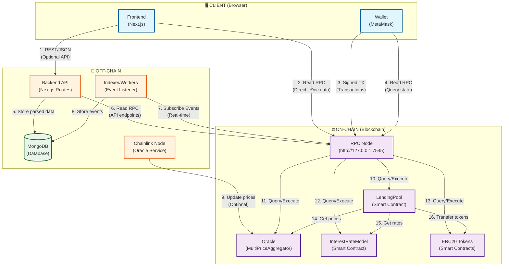

# 🏗️ Sơ Đồ Kiến Trúc Hệ Thống - Chuẩn Chỉ

## 🔍 Phân Tích Sơ Đồ Hiện Tại

### **✅ Đúng:**
1. Wallet gửi signed transactions trực tiếp qua RPC Node
2. Wallet đọc RPC trực tiếp
3. Backend có read RPC schedule/cron (cho indexer)
4. Backend lưu parsed data vào MongoDB
5. Chainlink Node update prices lên Oracle

### **❌ Thiếu/Chưa Đúng:**
1. **Frontend cũng gọi RPC trực tiếp** (không chỉ qua Wallet)
2. **Indexer** chưa được thể hiện rõ (đang ở Backend)
3. **Flow đọc data** chưa rõ: Frontend có thể đọc từ API hoặc RPC trực tiếp
4. **Cache layer** chưa được thể hiện

---

## 📊 Sơ Đồ Mermaid Chuẩn Chỉ



---

## 📝 Giải Thích Chi Tiết

### **1. Frontend → RPC Node (Trực Tiếp)**
```
Frontend gọi RPC trực tiếp để:
- Đọc balance
- Đọc positions
- Đọc reserve data
- Query contract state
```
**Code:**
```javascript
const provider = new ethers.JsonRpcProvider('http://127.0.0.1:7545');
const accountData = await pool.getAccountData(userAddress);
```

---

### **2. Frontend → Backend API (Optional)**
```
Frontend có thể gọi API để:
- Lấy cached data (nhanh hơn)
- Lấy transaction history
- Lấy analytics
```
**Code:**
```javascript
const response = await fetch('/api/positions/user');
const data = await response.json();
```

---

### **3. Wallet → RPC Node (Transactions)**
```
Wallet gửi signed transactions:
- Supply/Deposit
- Withdraw
- Borrow
- Repay
- Liquidate
```
**Code:**
```javascript
const signer = await provider.getSigner();
const tx = await poolContract.supply(tokenAddress, amount);
```

---

### **4. Indexer → RPC Node (Events)**
```
Indexer đọc events từ blockchain:
- Supplied events
- Withdrawn events
- Borrowed events
- Repaid events
- Liquidated events
```
**Code:**
```javascript
pool.on('Supplied', (user, asset, amount) => {
  // Store to MongoDB
});
```

---

### **5. Backend → MongoDB (Storage)**
```
Backend/Indexer lưu:
- Parsed transaction data
- User positions
- Reserve data
- Analytics
```

---

### **6. Chainlink → Oracle (Prices)**
```
Chainlink Node update prices:
- External price feeds
- Update on-chain Oracle
- LendingPool sử dụng prices
```

---

## 🔄 Flow Chi Tiết

### **Flow 1: User Đọc Data**

```
User muốn xem positions
    ↓
Frontend có 2 options:
    ↓
Option A: Gọi API (nhanh, có thể stale)
    Frontend → Backend API → MongoDB
    ↓
Option B: Gọi RPC trực tiếp (chậm, chính xác)
    Frontend → RPC Node → LendingPool
    ↓
Return data về Frontend
```

---

### **Flow 2: User Thực Hiện Transaction**

```
User click "Supply"
    ↓
Frontend gọi function supply()
    ↓
Wallet (MetaMask) ký transaction
    ↓
Wallet gửi signed TX → RPC Node
    ↓
RPC Node broadcast → Blockchain
    ↓
LendingPool execute transaction
    ↓
Emit Events (Supplied)
    ↓
Indexer bắt events → Lưu MongoDB
    ↓
Frontend refresh data
```

---

### **Flow 3: Indexer Đọc Events**

```
Indexer chạy real-time
    ↓
Subscribe events từ RPC Node
    ↓
Khi có event mới:
    - Parse event data
    - Lưu vào MongoDB
    - Update user positions
    ↓
Frontend có thể query từ MongoDB (nhanh)
```

---

## ✅ Sơ Đồ Chuẩn Chỉ

### **Điểm Quan Trọng:**

1. ✅ **Frontend gọi RPC trực tiếp** (không chỉ qua Wallet)
2. ✅ **Wallet chỉ cho transactions** (signed TX)
3. ✅ **Backend/Indexer đọc events** và lưu MongoDB
4. ✅ **Frontend có 2 options**: API (nhanh) hoặc RPC (chính xác)
5. ✅ **Indexer chạy real-time** để sync data

---

## 🎯 So Sánh Với Sơ Đồ Cũ

| Aspect | Sơ Đồ Cũ | Sơ Đồ Chuẩn |
|--------|----------|-------------|
| Frontend → RPC | ❌ Không rõ | ✅ Có (trực tiếp) |
| Indexer | ❌ Ẩn trong Backend | ✅ Tách riêng |
| Flow đọc data | ❌ Không rõ | ✅ 2 options |
| Cache layer | ❌ Không có | ✅ MongoDB |

---

**Sơ đồ này phản ánh đúng logic và luồng thực tế của hệ thống!** 🎯


